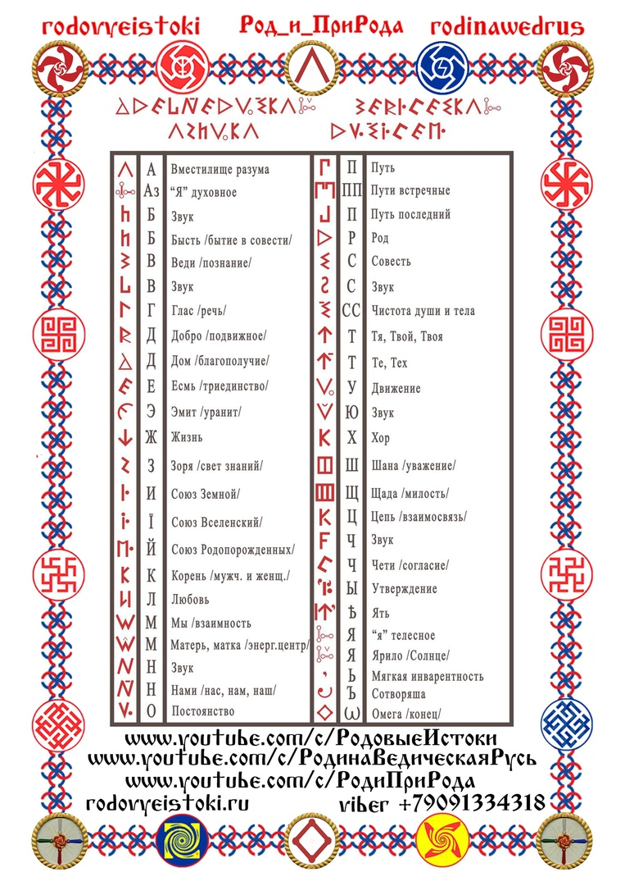

# Ведическая  Русо-арийская Руника  Азбука Русов Эт.

Древнюю Ведическую Мудрость необходимо познавать не только умом, её нужно принять в своё сердце и
вникнуть в каждый Образ. Но только тогда, когда информация (набор характеристик, который не даёт полного знания)
проходит через Сердце, Душу, Разум, Ум, Дух в жизненном опыте, и это становится Образом Жизни, тогда
информация становится Ведическим Знанием.
https://rodipriroda.com/posts/VedicheskajarusoarijskajaRunikaAzbukaRusov

**Источник:**
- Иванченко Александр Семёнович. - Гусев О.М. Роман-исследование «Путями Великого Россиянина», Санкт-Петербург. ООО «АНТТ-Принт», 2006г.- 334 стр.
- Дополнил: [Олег Геннадьевич Паньков](https://rodipriroda.com/VEDRUS/oleg-gennadevic-pankov)

**Картинка:** [Екатерина Константиновна Чудиновских](https://rodipriroda.com/VEDRUS/ekaterina-konstantinovna-cudinovskix)

*Сайт разработал [Сайдум](https://github.com/saydum)*
